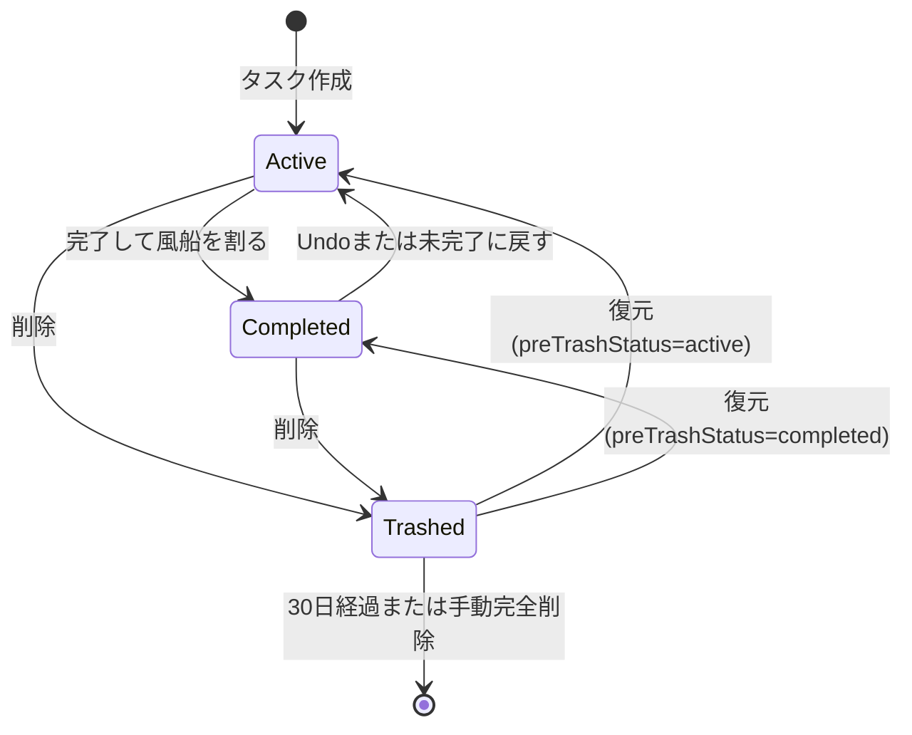

# PopTask MVP 仕様書

## 1. 文書情報

- 製品名: PopTask
- 対象: MVP
- 対応形態: スマートフォン優先のPWA
- データ保存: ブラウザ内のIndexedDB
- アカウント・サーバー・端末間同期: MVP対象外

## 2. 製品コンセプト

PopTaskは、タスクを風船として表示するローカルファーストのタスク管理アプリである。期限が近づくほど風船が大きくなり、可視性と緊急感を高める。タスクを完了すると風船が割れ、完了履歴に移動する。

## 3. MVPスコープ

### 3.1 対象

- タスクの作成、閲覧、編集、完了、削除、復元
- 期限に応じた10段階の風船サイズ
- 風船の浮遊、衝突、ドラッグ、反発
- 1階層のフォルダ管理
- 未完了、完了、ゴミ箱の状態管理
- タスク名とメモの部分一致検索
- ベストエフォートの段階通知
- オフライン利用
- JSONによるバックアップと復元

### 3.2 対象外

- ユーザー登録、ログイン、クラウド同期
- 繰り返しタスク
- フォルダの入れ子
- タスクの手動ソート
- Markdownやチェックリスト形式のメモ
- ドラッグ後の風船位置保存
- バックエンドからのWeb Push
- アプリ終了中を含む通知時刻の完全保証

## 4. 想定利用環境

- 縦画面のスマートフォンを最優先とする。
- デスクトップでも利用可能なレスポンシブUIとする。
- 表示・期限判定・通知判定は端末の現在ローカル時刻に基づく。
- 時刻は保存時にUTCのISO 8601形式へ変換する。
- タイムゾーンを変更した場合、同じ瞬間を新しいローカル時刻で表示する。

## 5. 情報設計

### 5.1 グローバルナビゲーション

画面下部に次の3タブを固定表示する。

1. 未完了
2. 完了
3. ゴミ箱

設定画面はヘッダーの設定アイコンから開く。

### 5.2 フォルダフィルタ

- 各主タブの上部に横スクロール式で表示する。
- 表示順は `すべて`、`未分類`、ユーザー作成フォルダとする。
- `すべて` はフォルダではなく、現在の主タブ内の全件を表示する固定ビューとする。
- `未分類` は `folderId = null` のタスクを表す。
- フィルタは未完了、完了、ゴミ箱の全タブで有効とする。

### 5.3 検索

- 現在の主タブと現在のフォルダフィルタに対して適用する。
- タスク名とメモを対象に部分一致検索する。
- 英字の大文字・小文字は区別しない。
- 入力中は150ms程度のデバウンスを行う。
- 空文字の場合は全件を表示する。

## 6. タスク機能

### 6.1 タスク作成

- 未完了タブ右下の固定FABから作成モーダルを開く。
- 必須項目はタスク名と期限日時とする。
- 任意項目はフォルダ、膨張開始タイミング、メモとする。
- フォルダの初期値は `未分類` とする。
- 膨張開始の初期値は `72時間前` とする。
- 膨張開始の選択肢は `24時間前 / 72時間前 / 7日前` とする。
- 期限入力には端末標準の日時ピッカーを使用する。
- 期限は作成時点より後の日時に限る。

### 6.2 入力制約

| 項目 | 制約 |
| --- | --- |
| タスク名 | 必須、1〜80文字、前後空白を除去 |
| 期限日時 | 必須、端末ローカル時刻で入力 |
| メモ | 任意、0〜2,000文字のプレーンテキスト |
| フォルダ | 任意、0または1個 |
| 膨張開始 | `24 / 72 / 168`時間のいずれか |

### 6.3 詳細・編集

- 未完了の風船を通常タップすると、下から出るモーダルシートを開く。
- モーダル最上部に完了ボタンを配置する。
- タスク名、期限日時、フォルダ、膨張開始、メモの全項目を編集可能とする。
- 削除操作はモーダル下部に弱い視覚優先度で配置する。
- 変更を保存した時点で `updatedAt` を更新し、サイズと将来の通知判定を再計算する。

### 6.4 完了

- 詳細モーダル最上部の完了ボタンで完了する。
- 300〜500msの破裂アニメーションと小さな破片の拡散を表示する。音は再生しない。
- アニメーション後、タスクを即時に完了タブへ移動する。
- 画面下部に5秒間だけ薄い `元に戻す` トーストを表示する。
- Undoした場合は未完了に戻し、`completedAt` を空にする。
- 完了タスクは無期限に保持する。
- 完了一覧から未完了に戻せる。戻した時点の現在時刻でサイズと超過状態を再計算する。
- 完了タブでは割れた風船を再現せず、完了日時付きの履歴カードで表示する。

### 6.5 削除とゴミ箱

- 削除は完全削除ではなく、ゴミ箱への移動とする。
- 削除直前の状態が未完了か完了かを `preTrashStatus` に保持する。
- 削除後5秒間だけ `元に戻す` トーストを表示する。
- ゴミ箱からの復元時は、削除前の状態、フォルダ、期限、その他全データを維持する。
- ゴミ箱内では残り保持日数を表示する。
- `deletedAt + 30日` を過ぎたタスクは自動で完全削除する。
- 自動削除判定は起動時と、アプリ起動中の24時間ごとに実行する。
- ゴミ箱では手動の完全削除も可能とし、実行前に確認する。
- ゴミ箱のタスクは履歴カードで表示する。

## 7. 風船表示

### 7.1 表示内容

- 風船内にタスク名と期限を常時表示する。
- 長いタスク名は2行まで表示し、超過分は省略する。全文は詳細で確認できる。
- 期限は通常 `M/D HH:mm` 形式、同年でない場合は `YYYY/M/D HH:mm` で表示する。
- 風船色は所属フォルダ色とする。未分類は専用の既定色とする。

### 7.2 サイズ計算

サイズは10段階とし、10分ごと、アプリのフォアグラウンド復帰時、タスク変更時に再計算する。

```text
startAt = dueAt - inflationWindowHours

now <= startAt:
  progress = 0

startAt < now < dueAt:
  progress = (now - startAt) / (dueAt - startAt)

now >= dueAt:
  progress = 1

eased = progress ^ 2
sizeLevel = clamp(1 + floor(eased * 10), 1, 10)
```

- 非線形の `progress^2` により期限直前ほど大きく変化させる。
- 最小直径は画面幅の18〜20%相当を基準とし、88pxを可読性の目安とする。
- 最大直径は画面幅の35%以下、かつ160px以下とする。
- 直径はレベル1から10の間を線形補間する。
- 期限超過後はレベル10に固定する。

### 7.3 期限超過

- 期限を過ぎても風船は自動で割れず、未完了に残る。
- 最大サイズ、警告色、微振動アニメーションで表示する。
- フォルダ色より警告色を優先する。フォルダは小さなラベルで識別可能にする。
- `期限超過` 文言と超過時間を表示し、色だけに依存しない。
- 警告アニメーションは `prefers-reduced-motion` 有効時に停止する。

### 7.4 並び順と初期配置

- 優先順は、期限超過、期限が近い順、同じ期限なら更新が新しい順とする。
- 自由配置のため、並び順は初期生成位置の上から下への優先度として反映する。
- 風船位置は保存しない。表示開始時に衝突しない初期位置を自動生成する。
- 必要な高さを持つスクロール可能な2Dフィールドに配置する。

### 7.5 物理振る舞い

- 風船は基本位置の周囲で弱く上下左右に浮遊する。
- 各風船は円形の衝突領域を持ち、重なりそうな場合は互いに押し合う。
- 初期位置への弱い復元力を与え、タスクが画面の一方へ偏らないようにする。
- ユーザーは風船をドラッグで動かせる。ドラッグ中も他の風船と衝突し、他の風船に移動や反発を与える。
- 指を離した後は弱い慣性を残し、減衰させる。
- 風船やフィールドの境界を貫通させない。
- 移動量8px未満の短い操作はタップ、それ以上はドラッグと判定する。
- 風船上でドラッグが始まった後だけページスクロールを抑止する。空白部分では通常どおりスクロールできる。
- `prefers-reduced-motion` 有効時は自動浮遊を停止するが、衝突回避とドラッグは維持する。

## 8. フォルダ

### 8.1 フォルダ管理

- フォルダタブ端の管理アイコンから管理モーダルを開く。
- 作成、名前変更、色変更、削除ができる。
- フォルダ名は1〜30文字、前後空白除去後に必須とする。
- 同じフォルダ名の重複は許可しない。比較時は英字の大文字・小文字を区別しない。
- フォルダ削除時、所属していた未完了、完了、ゴミ箱の全タスクを未分類へ移す。
- フォルダの並び替えはMVP対象外とし、作成日時の古い順で表示する。

### 8.2 12色プリセット

フォルダ色は次の12色から1色を選択する。警告用の赤はフォルダ色に使用しない。

| ID | 色 | HEX |
| --- | --- | --- |
| sky | スカイ | `#0284C7` |
| blue | ブルー | `#2563EB` |
| indigo | インディゴ | `#4F46E5` |
| violet | バイオレット | `#7C3AED` |
| fuchsia | フクシア | `#C026D3` |
| pink | ピンク | `#DB2777` |
| orange | オレンジ | `#EA580C` |
| amber | アンバー | `#D97706` |
| lime | ライム | `#65A30D` |
| green | グリーン | `#16A34A` |
| teal | ティール | `#0D9488` |
| cyan | シアン | `#0891B2` |

- 12色は互いに識別しやすい色とする。新規フォルダの初期色には、可能な限り現在使用されていない色を割り当てる。
- フォルダ数は12個に制限せず、ユーザーが色を選び直す場合やフォルダが12個を超える場合は色の重複を許可する。
- 未分類には上記と別の中立色 `#64748B` を使用する。
- 期限超過の警告色は `#DC2626` を基準とする。

## 9. 通知

### 9.1 通知時点

未完了タスクについて、アプリ全体で共通の次の5回を通知候補とする。

1. 期限48時間前
2. 期限24時間前
3. 期限6時間前
4. 期限1時間前
5. 期限日時ちょうど（超過状態への遷移時）

- 期限後に追加通知は送らない。
- 完了またはゴミ箱へ移動した時点で将来の通知対象から外す。
- 未完了へ復元した場合は、現在時刻より後の通知候補だけを再計算する。
- 作成時または期限変更時に既に過ぎている通知は遡及送信しない。
- 同じタスクの同じ通知時点を二重に送信しない。

### 9.2 Web版の制約

- 通知は補助機能とし、主要な緊急度表現はアプリ内の風船で行う。
- 通知権限がなくてもすべてのタスク管理機能を使える。
- サーバーからのPush配信を使用しないため、アプリが閉じている時やOSがバックグラウン実行を止めている時の通知は保証しない。
- 対応ブラウザと実行可能なタイミングでのみ、Service Workerから通知を表示する。
- アプリ内では1分ごととフォアグラウンド復帰時に通知時点を判定する。
- 通知権限のブラウザダイアログは、初回起動直後ではなく、設定画面でユーザーが `通知を有効にする` を押した時に要求する。

## 10. 初回起動と空状態

- サンプルタスクは作成しない。
- 初回起動時は空の未完了画面を表示する。
- FABの近くに `このボタンから最初のタスクを追加` という抑えたヒントを表示する。
- ヒントはFAB操作時または明示的に閉じた時に二度と表示しない。
- 強制的な複数ページのオンボーディングは行わない。

## 11. 設定画面

### 11.1 通知

- 現在の権限状態を `未許可 / 許可 / 拒否 / 非対応` で表示する。
- 許可要求の開始操作を提供する。
- 拒否後はブラウザ側の設定が必要であることを説明する。
- 固定の通知時点を読み取り専用で表示する。

### 11.2 データ管理

- JSONエクスポート
- JSONインポート
- ゴミ箱を空にする
- すべてのローカルデータを削除

インポートはMVPでは現在データの全置換とする。マージは行わない。実行前に件数を表示し、明示的な確認を要求する。

### 11.3 アプリ情報

- アプリバージョン
- データスキーマバージョン
- 通知が補助機能であること
- データが現在のブラウザと端末にのみ保存されること

## 12. バックアップ仕様

### 12.1 エクスポート

- 未完了、完了、ゴミ箱のタスク、フォルダ、アプリ設定を含む。
- 通知権限はブラウザ管理のため含めない。
- ファイル名は `poptask-backup-YYYYMMDD-HHmmss.json` とする。
- 出力前に30日を過ぎたゴミ箱データを削除する。

### 12.2 インポート

- JSON構文、スキーマバージョン、必須フィールド、ID重複、参照整合性を検証する。
- 不正な場合は現在データを変更せず、エラー理由を表示する。
- 正常な場合は1つのIndexedDBトランザクションで全置換する。
- 置換後に30日を過ぎたゴミ箱データを削除し、サイズと将来の通知判定を再計算する。

### 12.3 JSONルート構造

```json
{
  "app": "PopTask",
  "schemaVersion": 1,
  "exportedAt": "2026-06-13T00:00:00.000Z",
  "tasks": [],
  "folders": [],
  "settings": {}
}
```

## 13. データモデル

### 13.1 Task

```ts
type TaskStatus = "active" | "completed" | "trashed";
type PreTrashStatus = "active" | "completed" | null;
type InflationWindowHours = 24 | 72 | 168;

interface Task {
  id: string;                    // UUID
  title: string;
  memo: string;
  dueAt: string;                 // UTC ISO 8601
  inflationWindowHours: InflationWindowHours;
  folderId: string | null;
  status: TaskStatus;
  preTrashStatus: PreTrashStatus;
  completedAt: string | null;
  deletedAt: string | null;
  createdAt: string;
  updatedAt: string;
}
```

### 13.2 Folder

```ts
type FolderColorId =
  | "sky" | "blue" | "indigo" | "violet"
  | "fuchsia" | "pink" | "orange" | "amber"
  | "lime" | "green" | "teal" | "cyan";

interface Folder {
  id: string;                    // UUID
  name: string;
  colorId: FolderColorId;
  createdAt: string;
  updatedAt: string;
}
```

### 13.3 NotificationReceipt

```ts
type NotificationOffsetMinutes = 2880 | 1440 | 360 | 60 | 0;

interface NotificationReceipt {
  id: string;                    // `${taskId}:${dueAt}:${offsetMinutes}`
  taskId: string;
  dueAt: string;
  offsetMinutes: NotificationOffsetMinutes;
  notifiedAt: string;
}
```

### 13.4 Settings

```ts
interface Settings {
  id: "app";
  schemaVersion: 1;
  firstTaskHintDismissed: boolean;
  notificationsEnabled: boolean;
  createdAt: string;
  updatedAt: string;
}
```

## 14. 状態遷移



## 15. オフライン・PWA

- 初回のオンライン読み込み完了後、アプリシェルをService Workerでキャッシュする。
- タスクの閲覧、作成、編集、完了、削除、復元、検索、フォルダ管理、JSON入出力はオフラインで動作する。
- 起動時にネットワークがなくてもローカルデータを開ける。
- Web App Manifestにアプリ名、アイコン、テーマ色、`display: standalone`、起動URLを定義する。
- 更新版のService Workerが待機中の場合、非破壊的な更新案内を表示する。

## 16. 推奨実装構成

- UI: React + TypeScript
- ビルド: Vite
- ローカルDB: IndexedDB + Dexie
- 物理演算: Matter.js
- PWA: Vite対応のWorkbox統合
- 日時処理: 標準 `Date` と `Intl.DateTimeFormat`
- ユニット/コンポーネントテスト: Vitest + Testing Library
- E2E: Playwright

データアクセスはUIから分離し、`TaskRepository`、`FolderRepository`、`SettingsRepository` を通す。状態遷移、サイズ計算、通知候補計算は副作用のない関数とし、単体テスト可能にする。

## 17. 性能・アクセシビリティ

- MVPの動作保証目安は全状慈合計1,000タスク、同時表示100タスクとする。
- 物理演算は表示領域とその近傍を中心に実行し、画面外の風船は更新頻度を下げる。
- アニメーションは `requestAnimationFrame` で実行し、非表示タブで停止する。
- タップ対象は最低44 x 44 CSS pxを確保する。
- キーボードだけで作成、詳細表示、編集、完了、削除を操作できる。
- フォーカス表示を常に視認可能にする。
- スクリーンリーダーにタスク名、期限、超過状態、フォルダを読み上げる。
- 色だけで状態を伝えない。
- 文字色は風船色とのコントラストに応じて白または濃色を自動選択する。

## 18. 主なエラー処理

- IndexedDBへの保存失敗時は、完了したように見せずエラーを表示する。
- 容量不足時はJSONエクスポートと不要データの削除を案内する。
- 参照先フォルダが存在しないタスクは起動時の整合性確認で未分類へ移す。
- 端末時刻が大きく変更された場合、復帰時にすべての表示中タスクを再計算する。
- 物理演算が安定しない場合はアニメーションを停止し、衝突しない静的配置にフォールバックする。

## 19. 受け入れ条件

### 19.1 タスク

- [ ] タスク名と期限だけで未分類タスクを作成できる。
- [ ] 全項目を詳細モーダルで編集できる。
- [ ] 完了時に破裂演出が再生され、完了一覧へ移動する。
- [ ] 完了と削除は5秒以内ならUndoできる。
- [ ] 完了一覧から未完了へ戻せる。
- [ ] ゴミ箱から削除前の状態へ復元できる。
- [ ] ゴミ箱のタスクが30日後に自動完全削除される。

### 19.2 風船

- [ ] 膨張開始前はサイズレベル1である。
- [ ] 膨張開始後は非線形に10段階で大きくなる。
- [ ] サイズは10分以内、復帰時、変更時に更新される。
- [ ] 期限超過後は最大サイズと警告表示のまま残る。
- [ ] 風船同士が重ならず、衝突で押し合う。
- [ ] ドラッグで他の風船に衝突と反発を与えられる。
- [ ] タップとドラッグが区別され、誤って詳細が開かない。

### 19.3 フィルタ・検索

- [ ] 3つの主タブすべてでフォルダフィルタが動作する。
- [ ] 現在の主タブとフォルダ内だけを検索する。
- [ ] タスク名またはメモの部分一致で絞り込める。
- [ ] 期限超過が先頭優先、次に期限が近い順で初期配置される。

### 19.4 オフライン・データ

- [ ] 初回読み込み後、通信なしでアプリを再起動できる。
- [ ] 通信なしで主要なタスク操作と検索が動作する。
- [ ] JSONエクスポート後、正しいファイルを全置換インポートできる。
- [ ] 不正なJSONのインポートで現在データが壊れない。
- [ ] 通知を拒否してもタスク管理機能は動作する。

## 20. 実装順序

1. PWAシェル、IndexedDB、データモデル
2. タスクCRUDと状態遷移
3. 主タブ、フォルダ、検索
4. サイズ計算と通常の風船表示
5. 物理衝突、浮遊、ドラッグ
6. 完了演出、Undo、期限超過表示
7. ゴミ箱自動削除
8. 通知判定と設定画面
9. JSONバックアップと復元
10. オフラインE2E、アクセシビリティ、性能調整
